# Interfacing TFT LCD with Arduino UNO

## Objectives:
Basic Interfacing of TFT LCD with Arduino UNO: 
1. Displaying Hello World
2. Displaying colorful Hello World
3. Displaying Rainbow Colorful Strips
4. Displaying a small Heart Pixel
5. Displaying a Random Box Pixel
6. Displaying a Circle Shape
## Tech Stack

**Hardware:**
- 2.4 Inch Touch Screen TFT Display Shield for Arduino UNO
- Arduino UNO
- PC to Arduino connecting cable

**Software/Tools Used:** 
- Arduino IDE
- Install the required libraries if you haven't installed it

## Images of Hardware Components: 
- Arduino UNO: 
    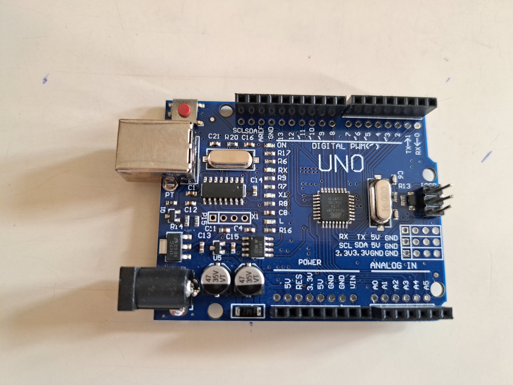
- TFT Display:
  
    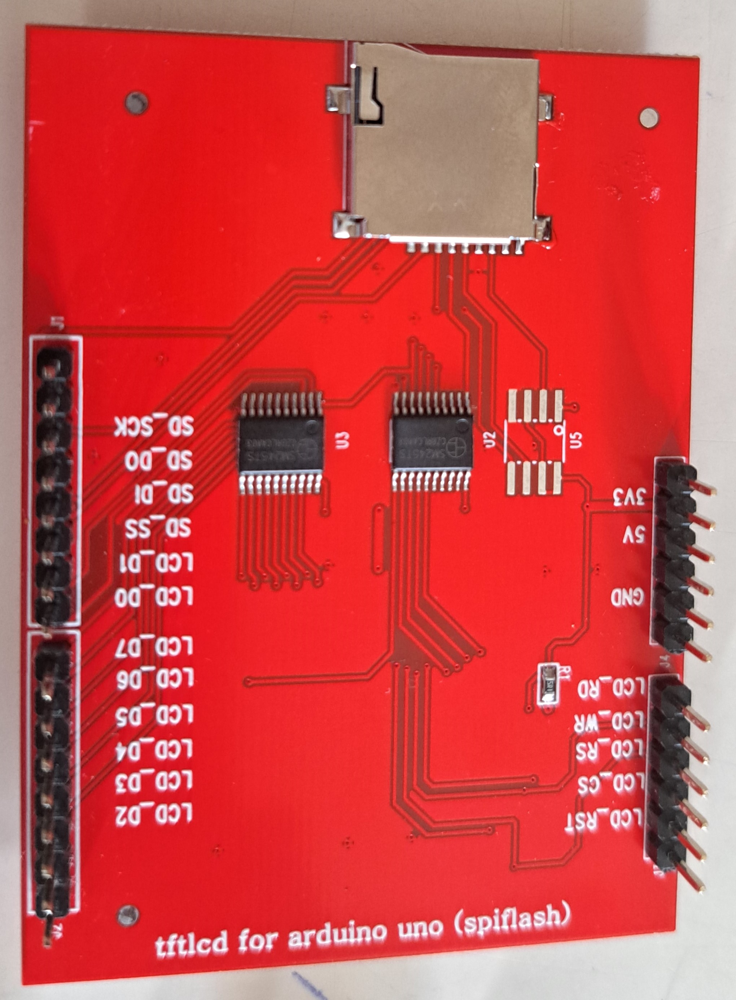

    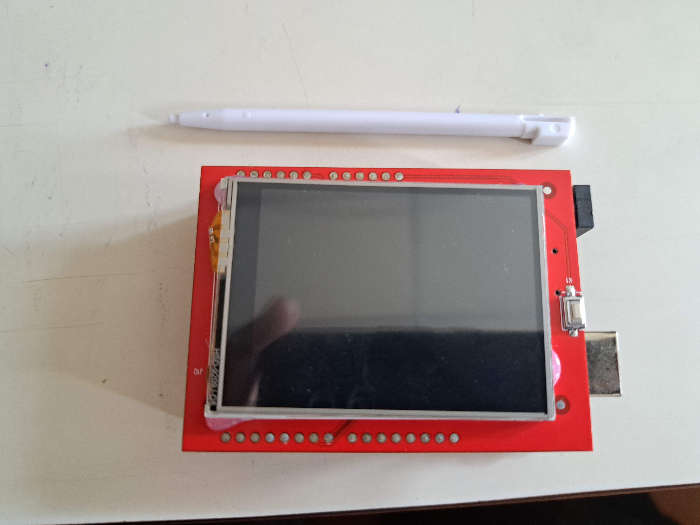

## Working of code:
1. **Displaying Hello World:** 
- Include Libraries: 
    - MCUFRIEND_kbv: Library for interfacing TFT displays.
    - Adafruit_GFX: Graphics library for drawing shapes and text.
- **Pin Definitions:**
    - Define pins for the TFT display (CS, CD, WR, RD, RST).
- **Initialize TFT:**
    - Start the TFT display, specifying the controller ID (0x9341).
    - Set the display rotation, background color (Royal red), text color (Royal gold), and text size (2).
- **Setup:**
    - Set up the display with specified colors, rotation, and text settings.
- **Loop:**
    - In a continuous loop:
        - Clear the screen with a Royal red background.
        - Set the cursor position to (50, 50).
        - Print "Hello World" on the screen.
        - Wait for 2 seconds.
- ***Output:***

  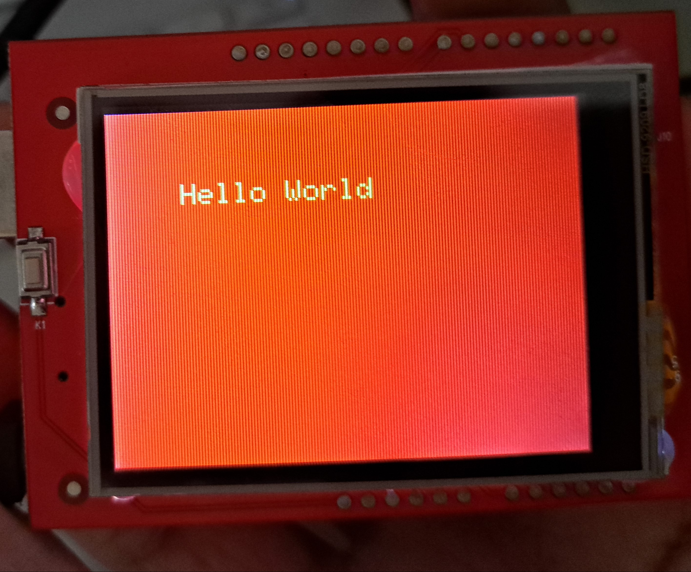
  
2. **Displaying colorful Hello World:**
- **Include Libraries:**
   - MCUFRIEND_kbv for interfacing with the TFT display.
   - Adafruit_GFX for graphics functions.

- **Pin Definitions:**
   - Define pins for the TFT display (CS, CD, WR, RD, RST).

- **TFT Initialization:**
   - Initialize the TFT display with a specified controller ID.
   - Set display rotation, background color (black), text color (white), and text size.

- **Main Loop:**
   - Clear the screen (black).
   - Set the text cursor position.
   - Loop through hue values (0 to 360) in steps of 10.
   - Convert each hue to RGB using the HSVtoRGB function.
   - Set text color to the converted RGB color.
   - Display "hello world" on the screen with the changing rainbow colors.
   - Pause for 200 milliseconds.

- **HSVtoRGB Function:**
   - Converts hue, saturation, and value (HSV) to red, green, and blue (RGB) colors.
   - Uses a switch-case statement to handle different hue ranges.
- ***Output:***

  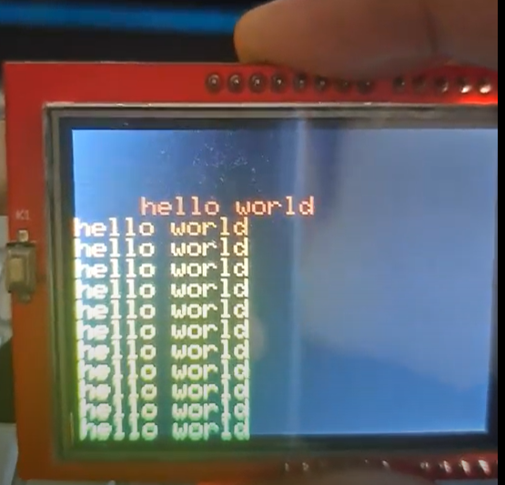
  
3. **Displaying Rainbow Colorful Strips:**
- **Libraries:** The code includes two libraries: `MCUFRIEND_kbv` for TFT display control and `Adafruit_GFX` for graphics functions.

- **Pin Definitions:** Pins for the TFT display (CS, CD, WR, RD, RST) are defined.

- **TFT Initialization:** The TFT display is initialized with the specified controller ID (0x9341), and its rotation is set. Text color, size, and other display settings are configured.

- **Setup Function:**
   - The setup function initializes the TFT display, sets rotation, text color, and size.
   - It then calls a function `rainbowBackground()` to fill the screen with a rainbow (VIBGYOR) background.

- **Loop Function:**
   - The loop function is empty, meaning it doesn't perform any continuous actions. It just runs once after setup.

- **Rainbow Background Function (`rainbowBackground`):**
   - This function creates a rainbow background on the TFT display.
   - Rainbow colors (VIBGYOR) are defined in the `colors` array.
   - The screen height is divided into 7 sections, each corresponding to a color in the rainbow.
   - For each pixel row in the display, a horizontal line is drawn with the color corresponding to its section in the rainbow.
- ***Output:***

  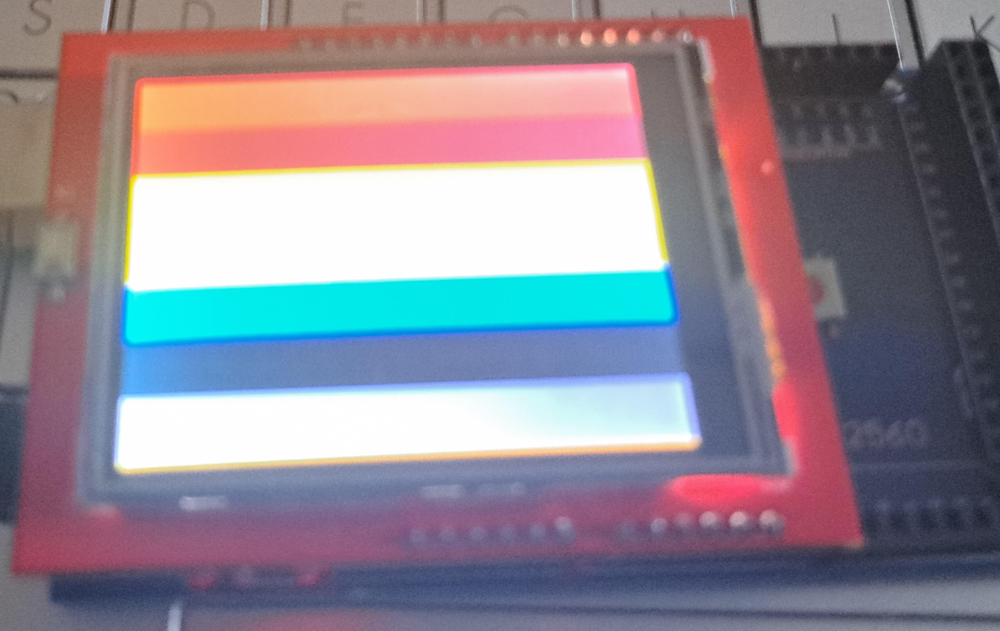
  
4. **Displaying a small Heart Pixel:**
- **Libraries:** The code includes the MCUFRIEND_kbv library for TFT display control.

- **Pin Definitions:** Pins for the TFT display (CS, CD, WR, RD, RST) are defined.

- **TFT Initialization:** The TFT display is initialized with the specified controller ID (0x9341), and its rotation is set. The background color of the display is set to black.

- **Image Data:** A 16x16 pixel image is defined in the `image_data` array with pixel values in 0xRRGGBB format.

- **Setup Function:**
   - Initializes the TFT display.
   - Sets rotation and background color.

- **Loop Function:**
   - Displays the predefined image on the TFT display using `setAddrWindow` to set the display window and `pushColors` to send the image data to the display.
   - After displaying the image for 5 seconds, the screen is cleared (filled with black) and a 2-second delay is introduced.
- ***Output:***

  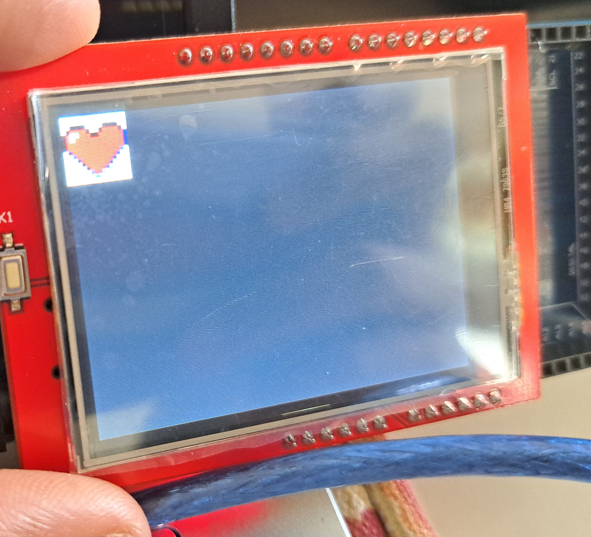
  
5. **Displaying a Random Box Pixel:**
- **Libraries:** The code includes the `Adafruit_GFX` and `MCUFRIEND_kbv` libraries for graphics and TFT display control.

- **Pin Definitions:** Pins for the TFT display (CS, CD, WR, RD, RST) are defined.

- **TFT Initialization:** The TFT display is initialized with the specified controller ID (0x9341), and its rotation is set.

- **Image Data:** The smiley face image data is stored in the `image_data` array in PROGMEM (program memory). The actual pixel values are not provided in the code snippet.

- **Setup Function:**
   - Initializes the TFT display.
   - Sets rotation.

- **Loop Function:**
   - Clears the TFT screen.
   - Calculates the offset to center the smiley face on the screen.
   - Nested loops iterate through the smiley face image data, drawing each pixel on the TFT display using `drawPixel`.
   - The `while (true) {}` statement is optional and can be used to stop the loop, displaying the image once.
- ***Output:***

  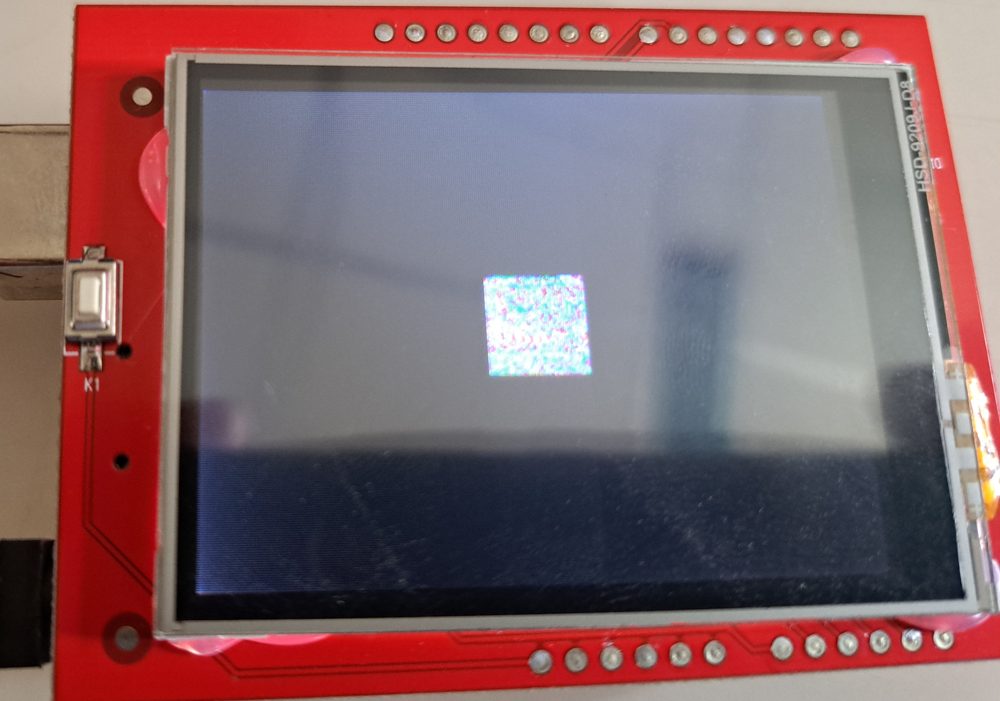
  
6. **Displaying a Circle Shape:** 
- **Libraries:** The code includes the `Adafruit_GFX` and `MCUFRIEND_kbv` libraries for graphics and TFT display control.

- **Pin Definitions:** Pins for the TFT display (CS, CD, WR, RD, RST) are defined.

- **TFT Initialization:** The TFT display is initialized with the specified controller ID (0x9341), and its rotation is set.

- **Setup Function:**
   - Initializes the TFT display.
   - Sets rotation.

- **Loop Function:**
   - Clears the TFT screen.
   - Defines the center coordinates and radius of the circle.
   - Nested loops iterate through a rectangular area that encompasses the circle.
   - Checks if each pixel is inside the circle using the circle equation.
   - If a pixel is inside the circle, it is drawn in white (0xFFFF).
   - The `while (true) {}` statement is optional and can be used to stop the loop, displaying the image once.

- ***Output:***

  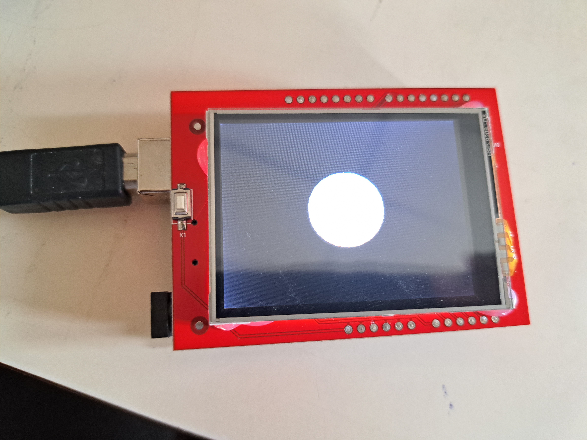
  
## Steps in Arduino IDE :

1. Open the Arduino IDE Software.

2. Click on File > New Sketch

  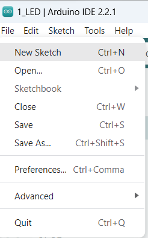

4. New window of code editor opens
   
  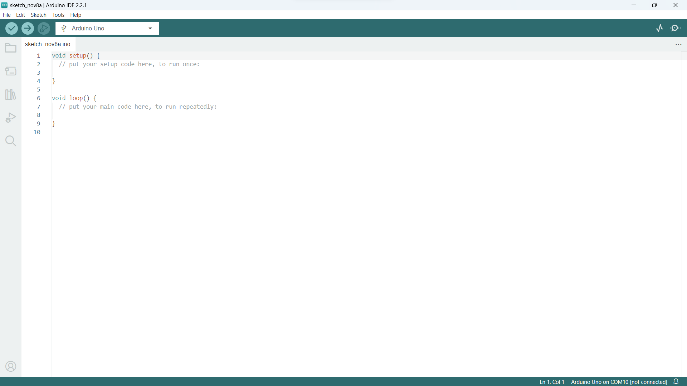

6. Write the required code in the Code Editor

7. Select the Board according to the specification (Arduino UNO here) COM Port varies from PC to PC.
 
  

8. To verify this, head towards Device Manager in PC -> USB Controllers. Check the port number.
     
  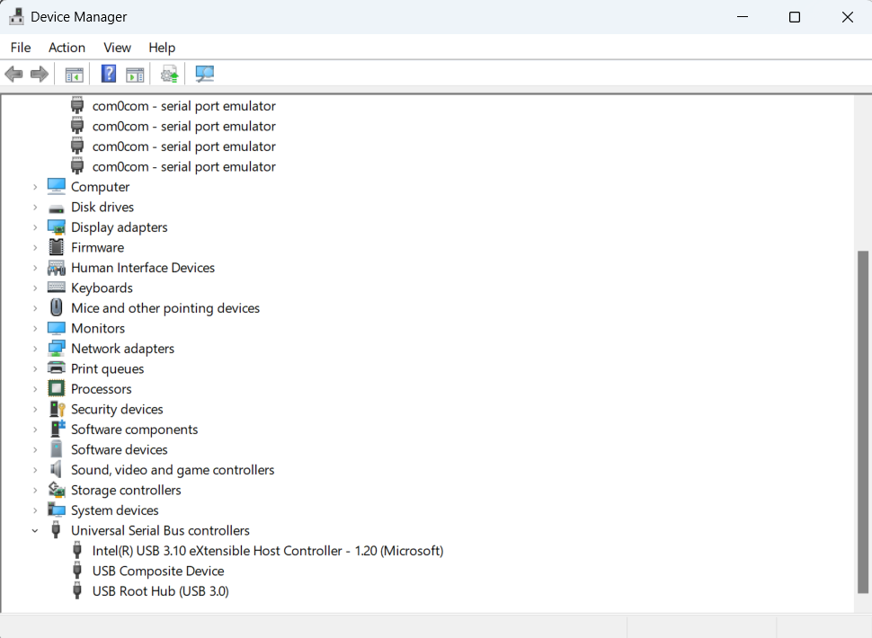

9. After writing the code click on 'Tick mark' to compile the code.
    
  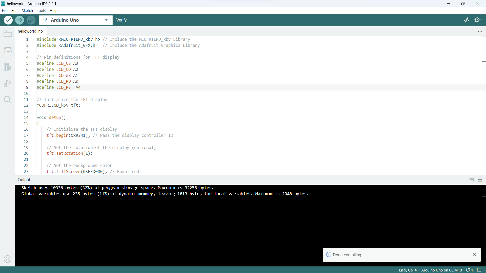

10. This is the final step and click on the right arrow mark to dump the code on the device.
   
  
